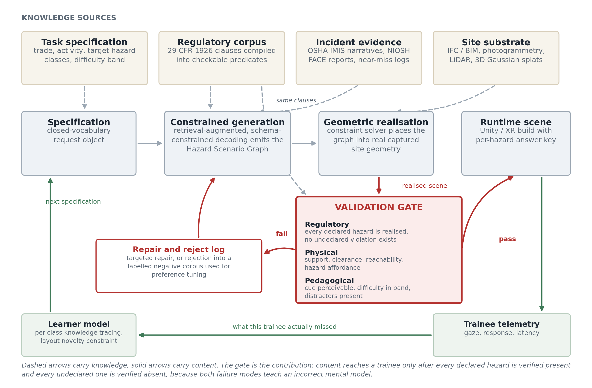

# SafeSiteGen


**Verifiable procedural generation of construction safety training scenarios.**

Reference implementation for the research proposal *Verifiable Procedural Content Generation for
Construction Safety Training*. Pure Python standard library, no dependencies, 92 passing tests.

Virtual reality safety training works, but every scenario is hand-authored by a 3D artist and a
safety subject matter expert, which costs weeks per scene. Procedural Content Generation via
Machine Learning is the obvious answer to an authoring bottleneck, except that its validity
criterion does not transfer. A generated game level has to be *playable*. A generated safety
scenario has to be **correct against a legal standard** and **sound as instruction**.

SafeSiteGen is a working pipeline for the second problem.

---

## The idea in one paragraph

A generative model can fail a safety scenario in two directions, and both install a wrong mental
model in the trainee:

1. It declares a hazard the realised geometry does not actually contain, so the trainee is scored
   wrong for missing something that was never there.
2. It introduces an unlabelled non-compliant configuration, so the trainee is scored wrong for
   correctly spotting a real hazard.

Conventional automated compliance checking only ever asks the second question, because its goal is
a compliant design. Training content needs both, because the artefact being validated is the
answer key. SafeSiteGen makes that two-sided test the admissibility gate: nothing reaches a trainee
until every declared hazard is verified present and every undeclared one is verified absent.

---

## Pipeline

```
specification
   -> constrained generation      Hazard Scenario Graph (typed, closed vocabulary)
   -> geometric realisation       constraint solver places the graph into site geometry
   -> validation gate             regulatory | physical | pedagogical
   -> runtime scene               Unity-importable JSON + offline viewer
```



The generator never writes coordinates. It emits semantics; the solver writes geometry; the gate
adjudicates. Keeping those three separable is what makes the system checkable.

---

## Results

300 specifications across 3 sites, 2 to 4 teaching points, difficulty targets sampled in
[0.2, 0.8], 25 percent synthetic specification-noise rate. Reproduce with:

```bash
python experiments/run_ablation.py --n 300 --fault-rate 0.25
```

| Arm | Placement solver | Validation gate | First-pass valid | Accepted after repair | Attempts |
|---|---|---|---|---|---|
| A unconstrained | no | no | **4.7 %** | 4.7 % | 1.00 |
| B solver only | yes | no | **43.0 %** | 43.0 % | 1.00 |
| C gate only | no | yes | 4.7 % | **26.0 %** | 3.62 |
| D full | yes | yes | 43.0 % | **94.3 %** | 1.69 |

Verification and constrained realisation are complementary and neither substitutes for the other.
The residual 5.7 percent rejection in arm D is the interesting number: that is the fraction a
system without a gate would have shipped to a worker.

**Fault detection.** The grammar backend does not hallucinate, so specification noise of the kind
generative models *do* produce is injected deliberately and the regulatory layer is scored on what
it catches.

| Injected fault | Caught |
|---|---|
| Phantom hazard (declared, then silently satisfied) | 97.5 % |
| Dropped control | 84.2 % |
| Parameter pushed across a regulatory threshold | 81.8 % |
| **Overall** | **93.0 %** |

**Accepted-set quality.** All 14 hazard classes reached, normalised class entropy 0.93, layout
uniqueness 99.7 percent, and 25.0 percent occupancy of the difficulty-dispersion expressive range
grid ([Smith and Whitehead, 2010](https://doi.org/10.1145/1814256.1814260)) with no single bin
above 14.5 percent, so the generator is not collapsing onto one kind of scene.
See [`results/expressive_range.svg`](results/expressive_range.svg).

---

## From a prompt to a walkable training environment

```bash
python -m safesitegen prompt \
  "a storm drain crew working in an unshored trench with the spoil piled right on the edge" \
  --out demo/scene1
```

```
prompt   "a storm drain crew working in an unshored trench with the spoil piled right on the edge"
intent   create  (backend: lexicon)
  - "spoil pile" -> trench_spoil_too_close  [1926.651(j)(2)]
  - "unshored" -> trench_no_protective_system  [1926.652(a)(1)]
  - "storm drain crew" -> trade pipelayer
  - site "storm drain" -> utility_trench_corridor

note       requested difficulty 0.50 is outside what this site and hazard set can
           reach ([0.32, 0.41]); clamped to 0.41
PASS  (17 checks, difficulty 0.41)
```

The parse trace is deliberate: a trainer has to be able to audit which words drove which
decision. The lexicon backend can only ever emit identifiers already in the taxonomy, so it
cannot invent a hazard class. `--backend llm` routes the same request through
schema-constrained decoding, with the same closed vocabulary as the enum.

Then edit the scene in place, and note that the edit is verified exactly as strictly:

```bash
python -m safesitegen prompt \
  "now add a crane working near the overhead power line and make it harder, but remove the spoil pile" \
  --modify demo/scene1/scenario.json --out demo/scene2
```

`demo/scene1/environment.html` opens a walkable first-person site: move with WASD, drag to
look, click what you believe is a hazard, press Enter to be scored against the answer key the
gate verified. No libraries, no build step, no network.

### What a gate failure actually looks like

```bash
python -m safesitegen prompt "ironworker on a steel deck with an unprotected \
    leading edge and an uncovered floor opening" --fault-rate 0.8 --seed 8 --no-gate
```

```
FAIL  (2/18 checks failed)
  - REG.no_unintended_violation [1926.1053(b)(1)]: entity e5_dist violates 1926.1053(b)(1)
    without a matching teaching point, so a correct trainee answer would be scored wrong
  - REG.no_unintended_violation [1926.601(b)(4)]: entity e6_dist violates 1926.601(b)(4)
    without a matching teaching point, so a correct trainee answer would be scored wrong
```

Two compliant distractors were accidentally made non-compliant by injected noise. A trainee
who spotted either would have been marked wrong for being right. Drop `--no-gate` and both are
caught and repaired on the second attempt.

---

## Quickstart

Python 3.10 or newer. Nothing to install.

```bash
git clone https://github.com/IQRAASGHAR1999/safesitegen.git
cd safesitegen

python -m safesitegen sites                 # list site substrates
python -m safesitegen classes               # list hazard classes and their clauses
python -m safesitegen rules -v              # the machine-checkable rule pack

# generate, validate and export one scenario
python -m safesitegen generate --site utility_trench_corridor --seed 42 \
       --fault-rate 0.3 --out out/

# watch the curriculum adapt to a simulated trainee
python -m safesitegen adapt --sessions 20 --seed 7

python -m unittest discover -s tests        # 92 tests
```

Example output, with an injected fault caught and repaired:

```
scenario   scn_utility_trench_corridor_00042
site       Utility trench corridor, storm drain tie-in  (30 x 12 m)
task       pipelayer, storm drain tie-in
teaching   ladder_insufficient_extension, backing_equipment_no_spotter, rebar_impalement
attempts   2   energy 0.01
injected   phantom_hazard:h3
repairs    reassert_hazard:h3

PASS  (18 checks, difficulty 0.50)
```

`out/viewer.html` opens straight from disk with no server and no network: site plan, teaching
points with their clauses, the trainee route, and the full validation report.

---

## What is in the box

| Module | Role |
|---|---|
| `schema.py` | Hazard Scenario Graph: typed entities, relations, hazard nodes, closed vocabulary |
| `site.py` | Site substrate, occupancy grid, reachability, sightlines |
| `knowledge/` | 14 clauses from 29 CFR 1926 as checkable predicates, 14-class hazard taxonomy, 3 sites |
| `generator.py` | Grammar backend, fault injection model, targeted repair loop |
| `llm_backend.py` | Optional schema-constrained language model adapter (not required) |
| `layout.py` | Simulated annealing placement over the constraint energy |
| `validate.py` | The three-layer gate |
| `learner.py` | Per-class Bayesian knowledge tracing, difficulty targeting, layout novelty |
| `metrics.py` | Validity, coverage, entropy, expressive range, dependency-free SVG plots |
| `prompt.py` | Natural language to specification, with an auditable parse trace |
| `export.py` | Unity scene contract, plan viewer, walkable environment |
| `environment.py` | First-person 3D training environment, no dependencies |
| `unity/` | Unity importer and trainee controller against the same contract |

### The rule pack

Each clause compiles to a predicate the checker can decide, for example:

```json
{
  "id": "1926.501(b)(1)",
  "topic": "Fall protection: unprotected sides and edges",
  "trigger": {"entity_kind": "worker", "context": "edge_exposure"},
  "predicate": {
    "kind": "threshold_requires_any_control",
    "param": "fall_height_ft", "op": ">=", "value": 6.0,
    "controls_any": ["guardrail_system", "safety_net", "personal_fall_arrest"]
  }
}
```

Distractors are genuinely compliant instances of the *same* regulated asset types, not different
objects with safe-sounding names. A compliant guardrail at 42 inches and a defective one at 33
inches are the same `asset_type`, so the checker has to actually decide the clause rather than
pattern-match a label.

---

## Honest limitations

- The default generator and prompt parser are a **stochastic grammar and a lexicon, not a
  language model**. Both run offline and deterministically so experiments are reproducible
  without an API key, and neither can emit an identifier outside the taxonomy. The
  constrained-decoding adapters and their JSON schemas are in `llm_backend.py` and
  `prompt.py`, but are not exercised by the test suite.
- The **3D environment is deliberately primitive**: boxes and capsules, no navmesh, no
  animation, no XR rig. It exists to show that the verified contract drives a real interactive
  scene, not to be a training product.
- **Fault rates are synthetic.** The injection model stands in for hallucination so the gate can be
  scored; it is not a measurement of any real model's error rate.
- **Site substrates are hand-specified**, not captured. The schema is identical to what an IFC
  import or a photogrammetric capture would populate, so a real capture drops in unchanged, but
  that substitution has not been made here.
- The rule pack is an **illustrative research subset** with paraphrased clause text. It is not a
  compliance tool. Consult the [eCFR](https://www.ecfr.gov/current/title-29/subtitle-B/chapter-XVII/part-1926)
  for authoritative language.
- Validation is 2.5D over a 1 m occupancy grid. Full 3D support, stability and multi-level
  reasoning are not implemented.

---

## Roadmap

1. Swap the grammar for schema-constrained decoding with retrieval over OSHA IMIS incident
   narratives, and measure real hallucination rates against the gate.
2. Replace hand-specified substrates with IFC import and photogrammetric or Gaussian-splat capture.
3. Preference-tune the generator on the rejected-sample corpus the gate already produces.
4. Unity runtime with an XR build and gaze telemetry feeding the learner model.
5. Expert panel study: blinded ratings of generated versus hand-authored scenarios.

---

## Citation

```bibtex
@software{asghar_safesitegen_2026,
  author  = {Asghar, Iqra},
  title   = {SafeSiteGen: verifiable procedural generation of construction
             safety training scenarios},
  year    = {2026},
  url     = {https://github.com/IQRAASGHAR1999/safesitegen}
}
```

Related work by the author on dynamic 3D reconstruction, which supplies the temporal element these
scenes will eventually need: **DynGS-Pro**, KSEM 2026,
[doi:10.1007/978-981-92-2759-4_3](https://doi.org/10.1007/978-981-92-2759-4_3).

## Licence

MIT. See [LICENSE](LICENSE).
